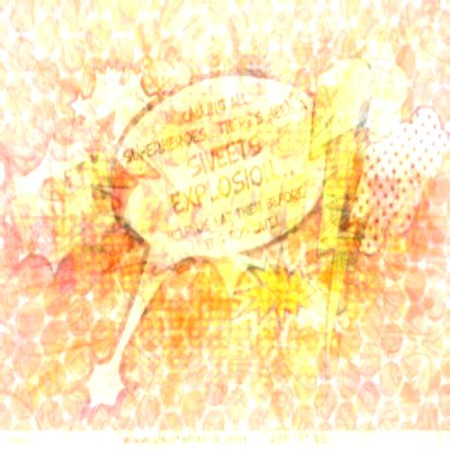
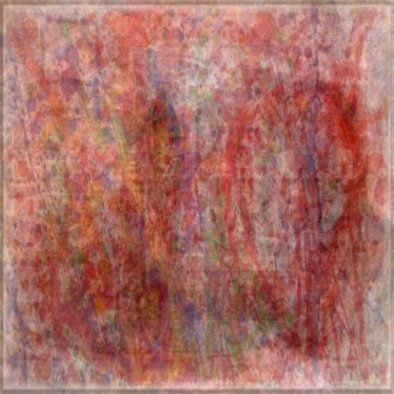

# Average Pixels [](https://travis-ci.org/liviu-/average-pixels)

Command line tool which takes a bunch of images, and outputs a JPEG combining the images using a weighted average where the weights are samples drawn from the Dirichlet distribution.

```sh
$ average-pixels download "party explosions boom" --offset 90 --count 30
```




## Installation

```sh
$ python3 -m pip install average-pixels
```
    
## Configuration
The application in `download` mode uses [Bing Search API](https://www.microsoft.com/cognitive-services/en-us/bing-image-search-api) to search for images so it requires the user to have an API key activated for Bing's search service. To obtain one:

- [Create a Microsoft account](https://signup.live.com/signup) if you don't have one
- Get an API key for the [Bing Image Search Service](https://www.microsoft.com/cognitive-services/en-us/bing-image-search-api)
    
    
Once obtained, the key may be provided through various methods:

- When prompted by the application
- By storing it in `~/.average_pixels_api`
- Or via the `AVERAGE_PIXELS_API` environment variable (e.g. `$ export AVERAGE_PIXELS_API=$key`)

## Example usage:

The application has 2 modes:

- `local`: Combines local files and outputs the combined image
- `download`: Takes keywords from the user, and combines images from Bing Image Search

```sh
$ average-pixels download "black cats"
```
    


```sh
$ average-pixels download "green field blue sky"
```
    


```sh
$ average-pixels download "just give me some random photo"
```


```sh
$ average-pixels download "no"
```


```sh
$ average-pixels download "insects" --count 30
```


```sh
$ average-pixels local /tmp/average_images --offset 40
```


```sh
$ average-pixels download "turner" --count 20
```


```sh
$ average-pixels download "jackson pollock painting" --count 10 --offset 30
```


```sh
$ average-pixels download "green" --count 100
```


```sh
$ average-pixels local images/
```



