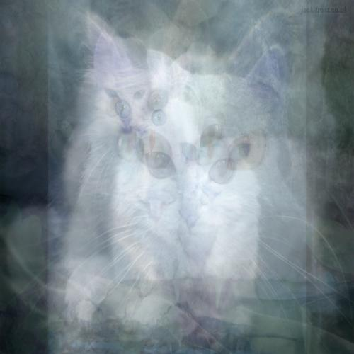

# Average Images

    $ python average_pixels.py "black cats"
  

    $ python average_pixels.py "white cat"
    

    $ python average_pixels.py "green field blue sky"
    

    $ python average_pixels.py "just give me some random photo"
